# Quantum Semantic Toolkit (QSTK)

**Author:** Christopher Agostino
**Company:** NPC Worldwide
**Contact:** info@npcworldwi.de

## Overview

Quantum Semantic Toolkit (QSTK) is a Python package for quantum semantic methods, leveraging the [npcpy](https://pypi.org/project/npcpy/) package to simplify LLM calls. QSTK is based on the observer-dependent phenomenon of meaning interpretation in natural language processing that LLMs and humans likewise exhibit. QSTK helps us efficiently use ensemble methods to explore and understand semantic meaning in context in a Markovian way.

## Installation

```bash
# not yet available
pip install qstk
```

Or clone and install locally:

```bash
git clone https://github.com/npc-worldwide/qstk.git
cd qstk
pip install -e .
```

## Requirements
- Python 3.10+
- npcpy>=1.3.33
- numpy
- pandas

Optional:
- matplotlib, chroptiks (interactive examples)
- sentence-transformers, scikit-learn, scipy (trajectory analysis)
- qiskit >= 1.0 (IBM quantum hardware)
- cirq (Google quantum hardware)

---

## Modules

### `qstk.qc` — Quantum Computing Submodule

Prepare Bell states, construct CHSH operators, run measurements on quantum simulators and real hardware, encode semantic states into qubits, and compare quantum results against LLM experiments.

```python
from qstk.qc import (
    bell_state, werner_state, parameterized_entangled_state,
    chsh_s_value, chsh_expectation_values, measure_state,
    entanglement_entropy, concurrence, fidelity,
    bell_circuit, chsh_circuit, semantic_circuit, to_qiskit, to_cirq,
    compare_quantum_llm, sweep_werner_comparison,
)

state = bell_state("phi_plus")           # (|00> + |11>)/sqrt(2)
s = chsh_s_value(state)                  # 2*sqrt(2) — Tsirelson bound
rho = werner_state(state, p=0.8)         # noise model
s = chsh_s_value(rho, is_density_matrix=True)
```

#### Bell States

All four maximally entangled Bell states with measurement simulations:

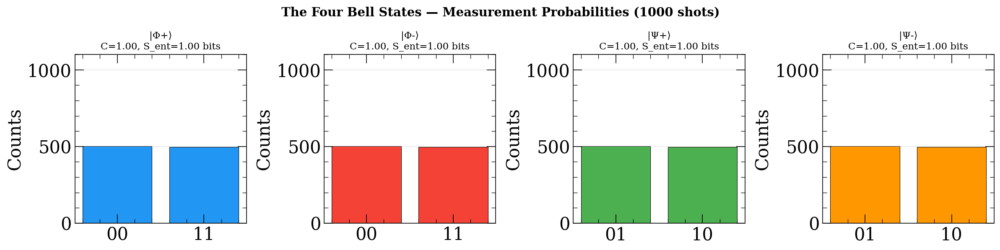

#### CHSH Angle Sweep

How the S-value changes as Bob rotates his measurement angle. The green zone is the quantum advantage region unreachable by any classical strategy:

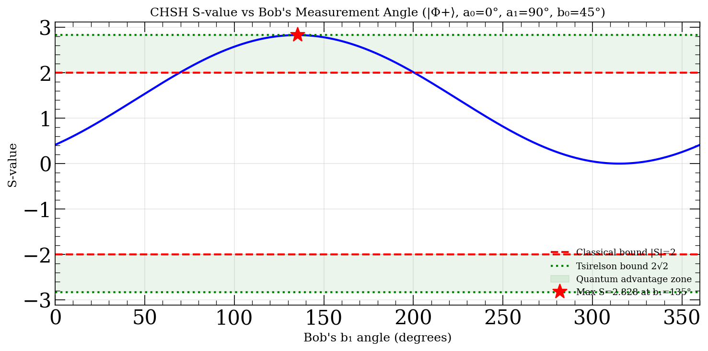

#### Parameterized Entanglement

Continuously tuning entanglement from separable (θ=0) to maximally entangled (θ=45°). Concurrence, S-value, and entropy all track together:

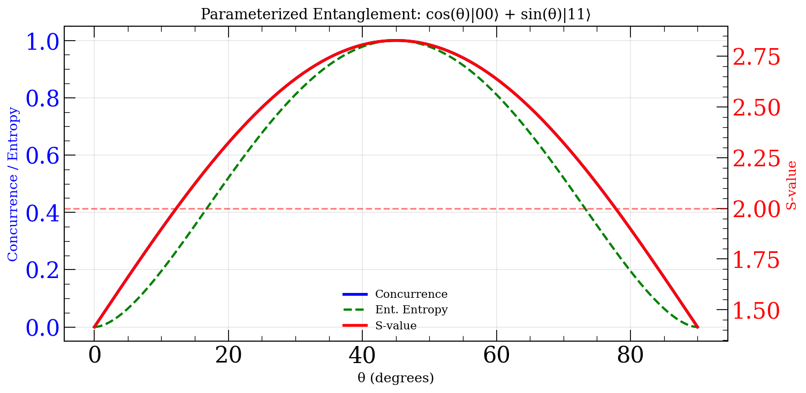

#### Werner States — Noise Degrades Violation

Werner states mix a Bell state with white noise. Violation disappears at p = 1/√2 ≈ 0.707:

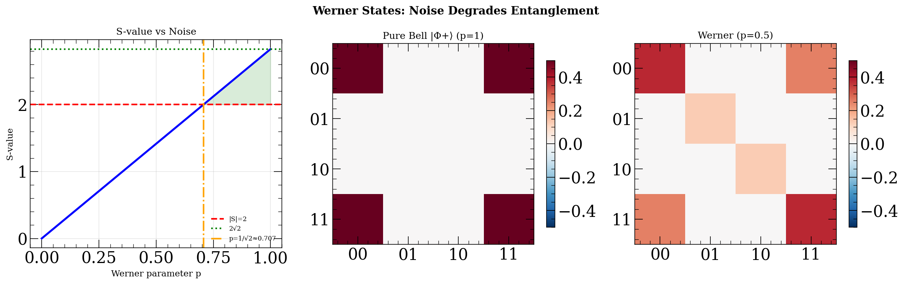

#### S-value Landscape

Full 2D heatmap of S-value over Bob's measurement angles. Red dashes mark the classical bound, green marks Tsirelson:

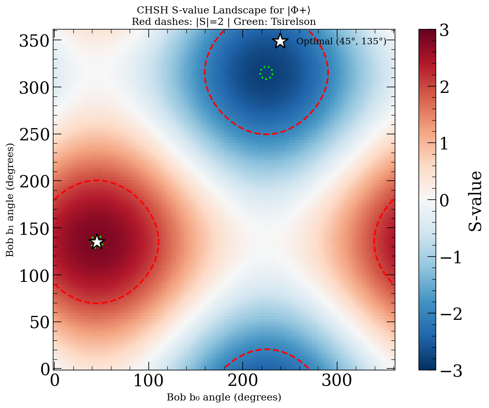

#### Entanglement Measures Landscape

2000 random 2-qubit states showing the tight relationship between concurrence, S-value, and entanglement entropy:

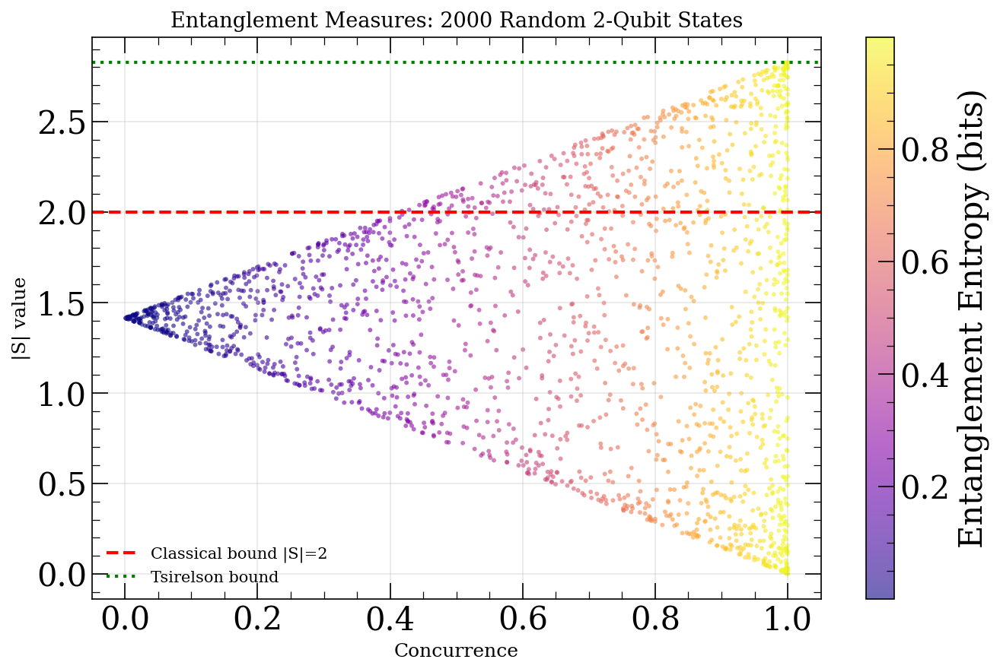

#### Semantic States — Word-Sense Entanglement

Encode word-sense correlations ("bank" × "bat") as qubit amplitudes. Correlated meanings produce CHSH violation; uniform or anti-correlated (with these operators) don't:

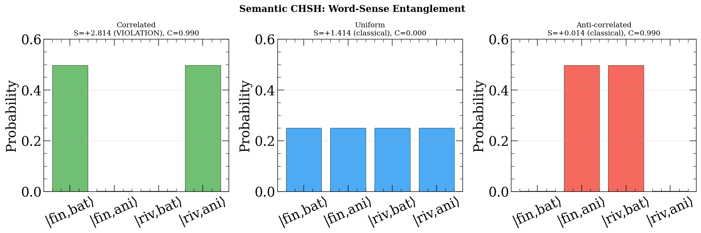

#### Quantum vs LLM Comparison

```python
comp = compare_quantum_llm({"A_B": 0.6, "A_B_prime": -0.5, "A_prime_B": 0.5, "A_prime_B_prime": 0.4})
print(f"LLM S={comp['llm_s']:.3f} vs Quantum S={comp['quantum_s']:.3f}")
print(f"Equivalent Werner p={comp['equivalent_werner_p']:.3f}")
```

#### Quantum Hardware — IBM Quantum & Amazon Braket

Run CHSH experiments on real quantum processors with cost tracking:

```python
from qstk.qc import (
    estimate_cost, print_cost_comparison, run_numpy,
    run_ibm, run_braket, compare_backends, ExperimentLog,
)

# Cost estimation before running
print_cost_comparison(n_shots=1024, n_circuits=4)

# Free local simulation
result = run_numpy("phi_plus", n_shots=4096)
print(f"S = {result.s_value:.4f}")  # 2.8284

# IBM Quantum (requires qiskit-ibm-runtime + token)
result = run_ibm("phi_plus", n_shots=1024, backend_name="ibm_brisbane")

# Amazon Braket (requires amazon-braket-sdk + AWS credentials)
result = run_braket("phi_plus", n_shots=1024,
                    device_arn="arn:aws:braket:::device/qpu/rigetti/Ankaa-3")

# Compare across backends
results = compare_backends("phi_plus", n_shots=1024,
                           backends=["numpy", "ibm", "braket_local"])

# Track costs
log = ExperimentLog("my_experiment.json")
result = run_ibm("phi_plus", n_shots=1024, log=log)
log.print_summary()
```

---

### `qstk.chsh` — CHSH Bell Test Math

S-value computation from LLM trial outcomes. Two methods: direct averaging and density matrix formalism.

```python
from qstk.chsh import (
    compute_chsh_products_binary, calculate_expectation_values_direct,
    calculate_expectation_values_density_matrix, calculate_s_value, check_violation,
)

products = compute_chsh_products_binary({"A": 1, "A_prime": -1, "B": 1, "B_prime": -1})
all_products = [products, ...]
s = calculate_s_value(calculate_expectation_values_direct(all_products))
print(f"S = {s:.4f}, violation = {check_violation(s)}")
```

#### Classical vs Quantum S-value Distributions

Synthetic experiments showing that classical strategies never exceed |S|=2, while quantum-correlated outcomes routinely do. Noise degrades the advantage:

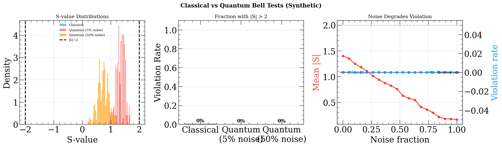

---

### `qstk.decoherence` — Decoherence Metrics

Measure script diversity, entropy, code emergence, coherence breakdown, and semantic drift as functions of sampling parameters.

```python
from qstk.decoherence import compute_decoherence_metrics

metrics = compute_decoherence_metrics("Your text here", prompt="original prompt")
print(f"Scripts: {metrics.script_diversity}, Entropy: {metrics.char_entropy:.2f}")
print(f"Code density: {metrics.code_fragment_density:.3f}")
```

#### Decoherence Dashboard

How increasing temperature breaks LLM coherence — script diversity explodes, code fragments emerge, coherent run lengths collapse:

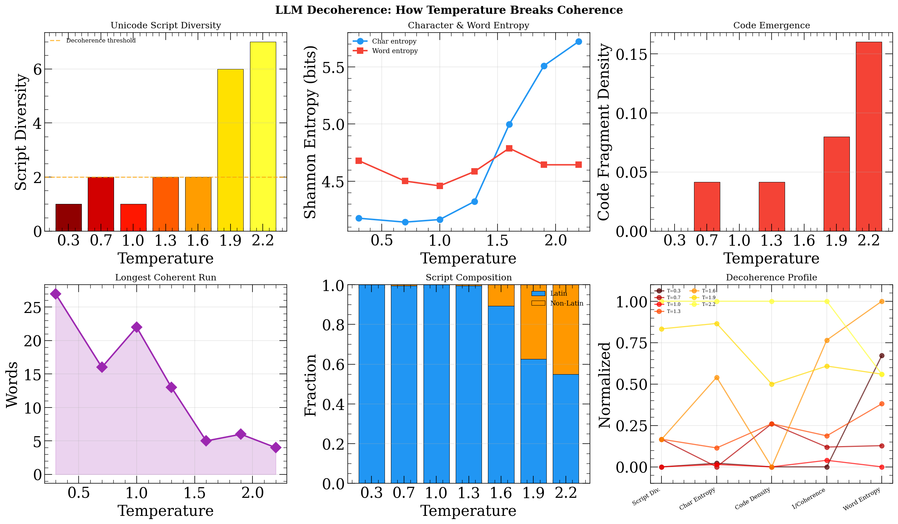

---

### `qstk.orbits` — Orbital Dynamics

Compute orbital elements, Lyapunov exponents, and trajectory classification from embedding-space trajectories.

```python
from qstk.orbits import compute_trajectory_dynamics, compute_orbital_elements, fit_ellipse

dynamics = compute_trajectory_dynamics(positions_2d)
orbital = compute_orbital_elements(positions_2d, dynamics.velocities)
print(f"e={orbital.eccentricity:.3f}, type={orbital.orbit_type.value}")
print(f"Lyapunov: {dynamics.lyapunov_exponent:.3f}, Chaotic: {dynamics.is_chaotic}")
```

#### Orbit Gallery

Five trajectory types with ellipse fits and Lyapunov exponent estimates:

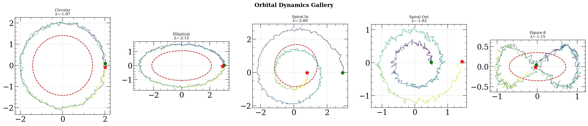

#### Orbit Detail — Velocities, Energy, Phase Space

Full dynamics breakdown of an elliptical orbit: velocity field, energy conservation, angular momentum, distance oscillation, and (r, ṙ) phase portrait:

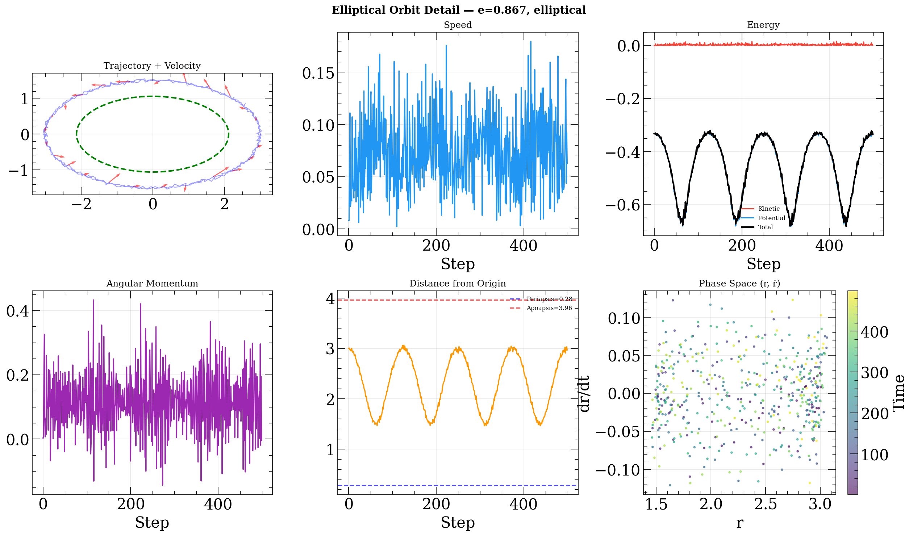

---

### `qstk.feynman_kac` — Feynman-Kac Agent Simulation

Agent-based population simulation with drift, diffusion, and potential (survival) components governed by stochastic differential equations.

```python
from qstk.feynman_kac import Agent, Environment

env = Environment(external_factors={"difficulty": {0: 0.2, 10: 0.8, 20: 0.3}})
for i in range(30):
    personality = {"bias": 0.1, "opinion_volatility": 0.15, "energy_recovery_rate": 0.05,
                   "opinion_adaptability": 0.05, "social_susceptibility": 0.1, "energy_volatility": 0.02}
    agent = Agent(i, {"opinion": 0.0, "energy": 0.8}, personality, env,
                  state_bounds={"opinion": (-1, 1), "energy": (0, 1)})
    env.add_agent(agent)
history = env.simulate(total_time=40.0, dt=0.1)
```

#### Population Simulation

50 agents with diverse personalities under time-varying external difficulty. Agents die when energy drops (survival potential). Shows population, opinion dynamics, energy, individual trajectories, final distribution, and opinion-energy phase space:

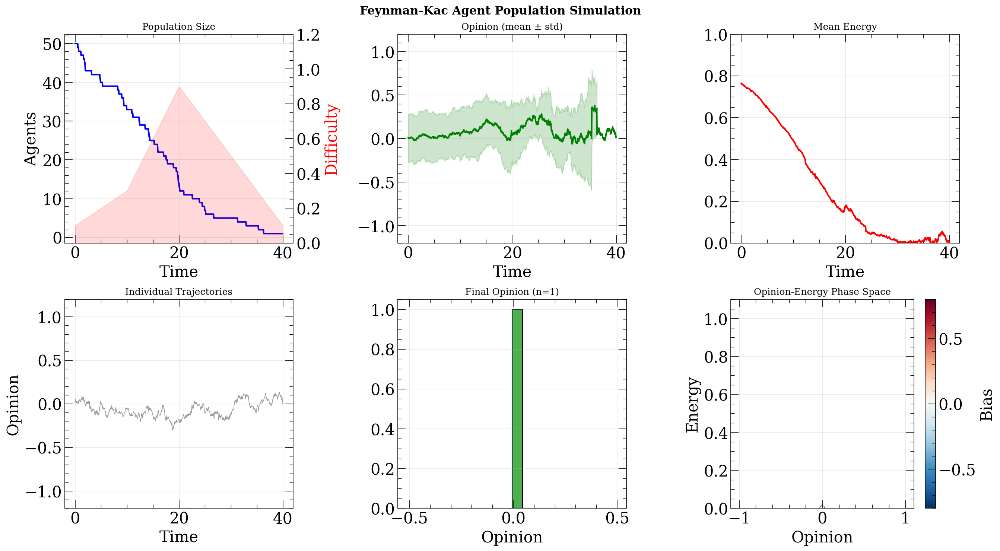

#### Custom Dynamics — Double-Well Polarization

Custom drift function `dx/dt = x - x³` creates two stable opinion attractors at ±1. Agents start near zero and bifurcate under noise:

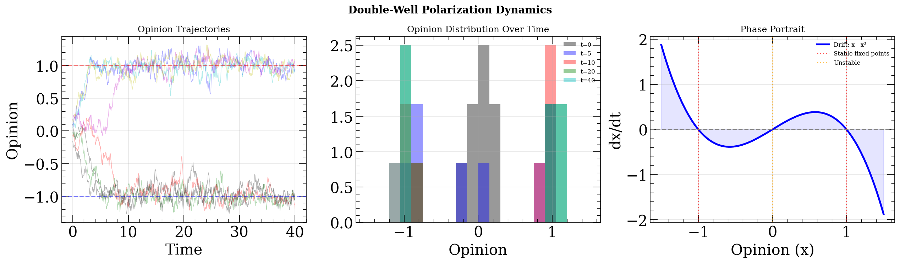

---

### `qstk.trajectories` — Semantic Trajectory Analysis

Track semantic hops, attractors, winding numbers, and Berry phase across generated text trajectories in embedding space. Requires sentence-transformers.

```python
from qstk.trajectories import SemanticWanderingAnalyzer, WanderingConfig

analyzer = SemanticWanderingAnalyzer()
config = WanderingConfig(model="gpt-4o", provider="openai", temperature=1.5, prompt="...")
trajectory = analyzer.analyze(generated_text, config)
print(f"Hops: {len(trajectory.hops)}, Winding: {trajectory.winding_number}")
print(f"Berry phase: {trajectory.berry_phase:.3f}, Attractors: {len(trajectory.attractors)}")
```

---

### `qstk.personas` — Persona Generation

```python
from qstk.personas import generate_persona, get_persona_prompt

persona = generate_persona()
prompt = get_persona_prompt(persona)
# "You are a 42-year-old from detroit, mi."
```

### `qstk.passages` — Text Passage Extraction

```python
from qstk.passages import prepare_passages
passages = prepare_passages("middlemarch.txt", num_passages=10, passage_length=5000)
```

### `qstk.statistics` — Combinatorial Significance Testing

Normalized Agreement Score (NAS) and hypergeometric p-value for theme vector agreement.

```python
from qstk.statistics import calculate_agreement_significance_combinatorial
nas, p_value = calculate_agreement_significance_combinatorial([1,0,1,1,0], [1,1,1,0,0], 5)
```

### `qstk.grid` — Parameter Grid Utilities

```python
from qstk.grid import build_sweep_configs, sweep_summary
configs = build_sweep_configs(models=[{"model": "gemma3:12b", "provider": "ollama"}],
                              word_pairs=WORD_PAIRS, trials_per_point=10)
```

### `qstk.results` — CSV Logging & Aggregation

```python
from qstk.results import init_csv, append_csv_row, load_previous_trials, aggregate_results
csv_path = init_csv("output/", "results.csv", columns=["trial", "model", "s_value"])
```

### `qstk.arrays` — NPCArray Integration

Use npcpy's `NPCArray` formalism for vectorized Bell test experiments with lazy evaluation and parallel inference.

```python
from qstk.arrays import create_bell_array, create_bell_meshgrid

grid = create_bell_meshgrid(
    models=["gemma3:12b", "qwen3:0.6b"], providers=["ollama"],
    temperatures=[0.2, 1.0, 1.8], top_ps=[0.37, 0.7, 1.0], top_ks=[10, 50, 100],
)
print(grid.shape)  # (54,) = 2 models * 3 temps * 3 top_ps * 3 top_ks
results = grid.infer(["Interpret: 'The bank was settled near the bat'"],
                      format="json").map(json.loads).collect()
```

---

## Interactive Examples

All examples are self-contained and run without LLM API calls.

```bash
pip install matplotlib chroptiks
```

| Example | Command | Description |
|---------|---------|-------------|
| QC Basics | `python examples/qc_basics.py` | Terminal walkthrough of all QC concepts |
| QC Interactive | `python examples/qc_interactive.py` | 6 interactive slider plots |
| CHSH Experiments | `python examples/chsh_experiments.py` | Classical vs quantum statistics |
| Decoherence | `python examples/decoherence_analysis.py` | Temperature-driven coherence breakdown |
| Orbital Dynamics | `python examples/orbital_dynamics.py` | Trajectory analysis + ellipse fitting |
| Feynman-Kac | `python examples/feynman_kac_sim.py` | Agent population SDE simulation |
| Hardware Guide | `python examples/hardware_guide.py` | Cost estimation + IBM/Braket setup |

To regenerate the README images:
```bash
python docs/generate_images.py
```

---

## Full Bell Test Example with NPCArray

**Prompts stay in your experiment script** — qstk provides only the infrastructure.

```python
import json, random
from npcpy.npc_array import NPCArray
from qstk.chsh import compute_chsh_products, calculate_expectation_values_density_matrix, calculate_s_value, check_violation
from qstk.personas import generate_persona, get_persona_prompt
from qstk.grid import get_param_grid

WORD_PAIRS = [
    [{"term": "bank", "meanings": [{'A': "financial institution", 'B': "river bank"}]},
     {"term": "bat", "meanings": [{"A": "baseball bat", "B": "flying animal"}]}],
]
A_SETTINGS = ['You are a foreign surgeon.', 'You are a bus driver.']
B_SETTINGS = ['You are haunted by past mistakes.', 'You are a sales rep.']

for model, provider in [("gemma3:12b", "ollama"), ("qwen3:0.6b", "ollama")]:
    arr = NPCArray.from_llms([model], providers=[provider])
    for temp, top_p, top_k in get_param_grid(provider):
        all_products = []
        for trial in range(10):
            persona = generate_persona()
            outcomes = {}
            for key in ["A", "A_prime", "B", "B_prime"]:
                settings = A_SETTINGS if "A" in key else B_SETTINGS
                system = f"{get_persona_prompt(persona)} {settings[1 if 'prime' in key else 0]}"
                result = arr.infer(["your prompt here"], system_message=system,
                                    format="json", temperature=temp).collect()
                # ... parse and classify ...
            if all(k in outcomes for k in ["A", "A_prime", "B", "B_prime"]):
                all_products.append(compute_chsh_products(outcomes))
        s = calculate_s_value(calculate_expectation_values_density_matrix(all_products))
        print(f"{model} T={temp}: S={s:.4f} violation={check_violation(s)}")
```

## License
MIT
